# Bug Alert

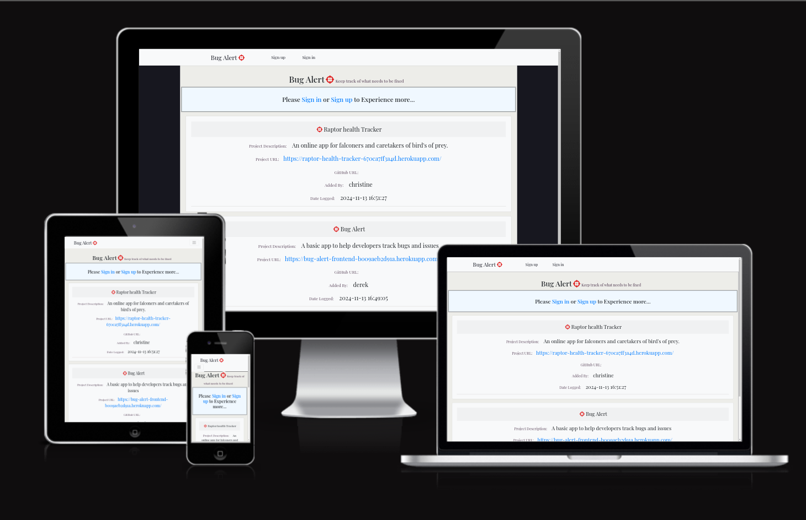

## Overview

Bug Alert is a frontend application designed to help developers track bugs and manage issues in their applications. Users can log in and add a project they want to track. Bugs, issues and console errors can be added. All registered users can add bugs and issues that they have observed. The issues are marked with their relavant priority eg. Critical, High, Medium or Low.
Users can also add comments about specific issues. The owner of an added issue can mark the issue as resolved.
The goal of Bug Alert is to have a place where all issues are stored, so that teams working on specific projects can be alerted about bugs and therefore have them squashed more efficiently.

## Live Site

https://bug-alert-frontend-b009aeb2d91a.herokuapp.com/

## Repository

https://github.com/Drekkg/bug-alert-frontend66.git

## GitHub Project
https://github.com/users/Drekkg/projects/9

## Author

Derek Garnett

## Features

**Navigation Bar**

The logged out Navbar contains the app title and logo; sign in and sign up links.
The title is also a link to the start page.

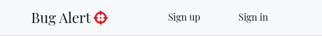

The logged in Navbar contains the logged in user's username, a link to the add a project page and a link to log out.

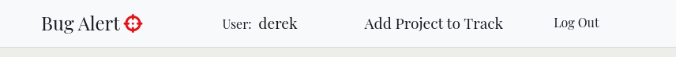

**Sign in Page**
The Sign in page contains the form to sign in. It also contains 2 buttons: one to sign in and one to close the form. Also a link to the sign up form if the user doesn't have an account.

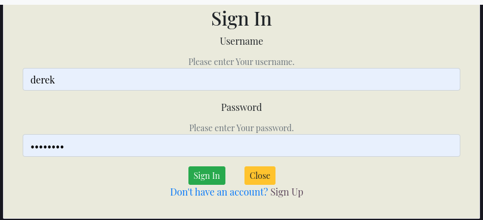

**Sign up Page**
The sign up page contains a form for the user to create an account.
It contains 2 buttons: a submit button to sign up and a button to close the form. It also contains a link to the sign in page.

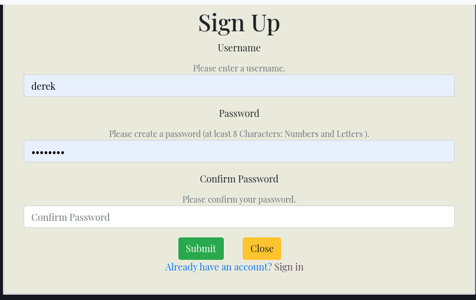

**Main Page - Logged out**

The main page in a logged out state contains a banner informing the user to either sign in or sign up. There are links that lead to the relevant page.
An un authorised user can view the list of projects on the application, but not any of the specific details.

- Each project header card will contain:
  - a description of the project.
  - A link to the project if supplied.
  - A link to the Github repository if supplied.
  - The owner of the project.
  - The date the project was added.

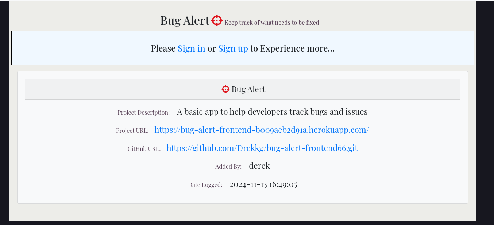

**Main Page Logged in**
The main page in a logged in state will additionaly display 3 buttons:

- an open the issues Panel button
  This button will open the list of issues that have been logged for the specific project.
- an edit Project Button(If the user is the owner of the project)
  This button will take the user to the edit project form. Here the user can edit the particulars of the project.
- A delete button(If the user is the owner of the project)
  This button will allow the user to delete the project.
  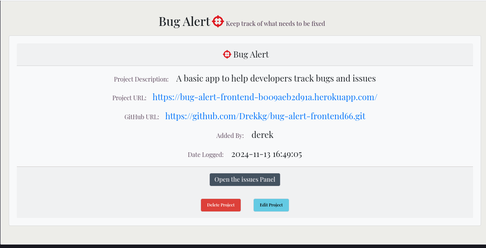

**Project Issues Page**
This page displays the issues that have been logged to each project.

- Add an issue button: The add an issue button will take the user to the add an issue form, where they can log an issue.

- The header contains: The project name and a unique issue number.
- if the issue has been resolved, a green badge with the word resolved will also be displayed.
- The main block contains:

  - The name of the user that logged the issue.
  - A description of the issue
  - A console error, if one has been uploaded.
  - The date the issue was logged.
  - If the issue is repeatable.
  - A coloured box containing the priority level of the issue.

- The view issue button:
  - A button that will take the user to the issue details page. Here the user
    can view and add any additional information regarding the issue.
- The Close/Re-open button:
  - If the user is the owner of the project they can set the issue as resolved by clicking the button. Once resolved the button can be used to reopen the issue.

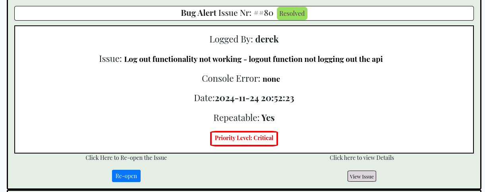

**Issue Detail Page**
The issue detail displays all the information of the project detail page, but also
including:

- A back to Issues Button:
  Takes the user back to the project Issues page
- A response Form:
  Here the user can enter any additional information or comments regarding the issue.
  Also any steps taken to rectify the problem/solutions/fixes/workarounds
- A button to enter and display the information.
- Comments box:
  A field that lists all comments and information that have been entered.
  including the username, time and date.

  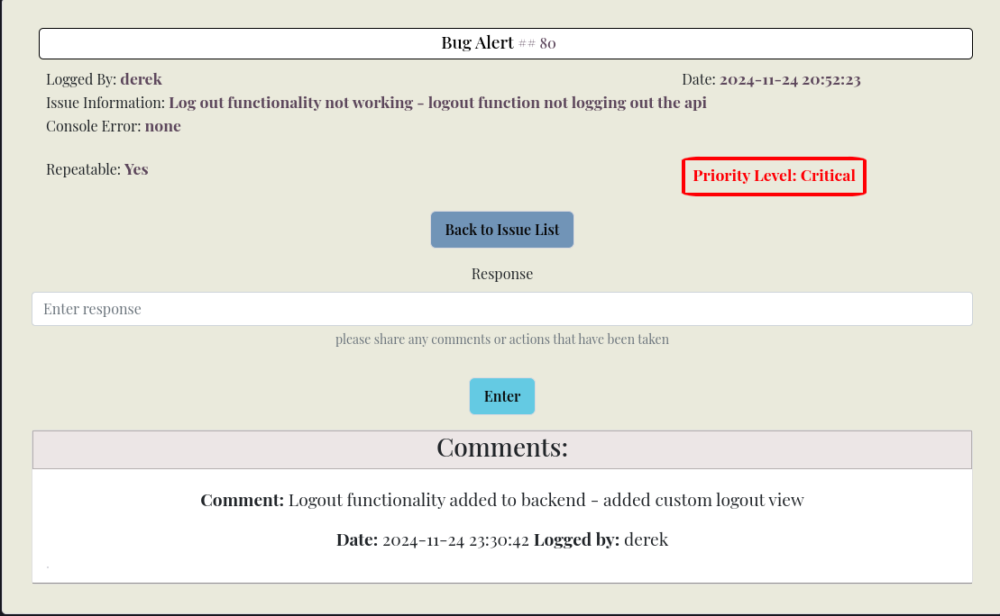

**Add Project Page**
The add project page is where a user can add a new project.

- It contains the relavant fields in the form.
  Project Name
  Project Description
  Project URL
  GitHub URL
  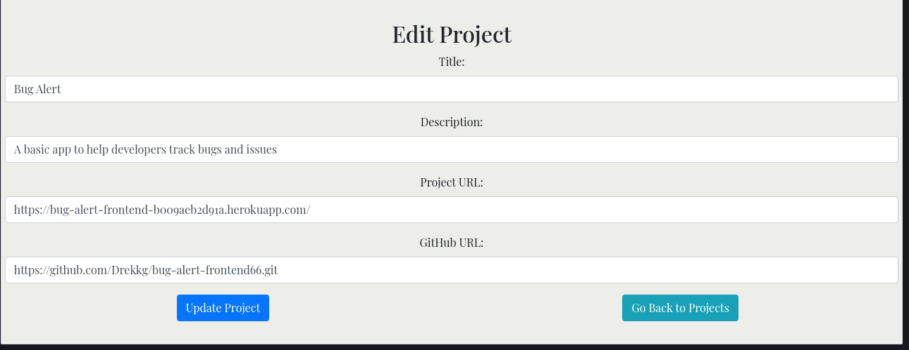

**Add Project Page**
The add project page contains a form for the relavant information.

- The project name
- A description of the project
- The project URL
- The GitHub Url
- A submit Button and a close button

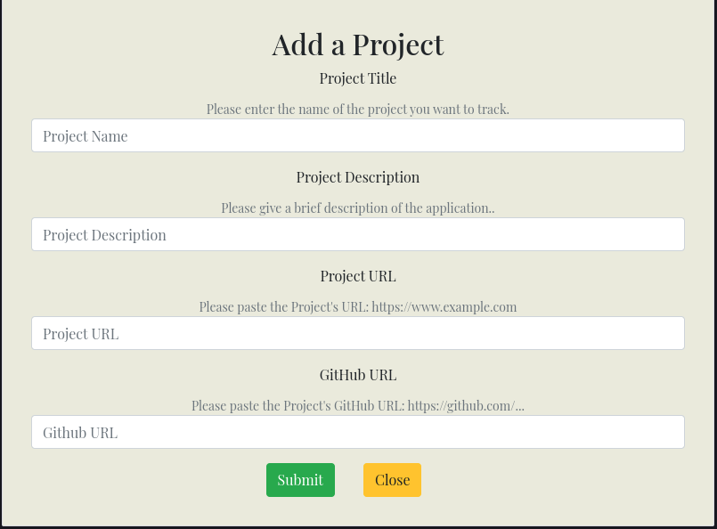

\*\*Future Features

- The ability to search projects and issues is a definite must for the future.
- Also the abilility to edit issues and comments.
- Assigning issues to a specific user.

## React Components

**Loading Badge**

The loading badge component is a custom spinner and is re-used in many of the app containers to display when the API is fetching or sending Data.

## UX

I strove to keep the design of Bug Alert simple, with basic colours and
typography, with the aim of focusing the attention of the user on the informational context.
While most users would be on full size screens, the app is still fully functional on mobile.
The idea of using cards that only display details when clicked is an attempt at keeping the UI clean and less cluttered and hopefully less distracting to the user.
The user can click on pertinent projects and issues without being flooded with irrelevant information.

- All operations that the user undertakes are confirmed on the front end:
  - Signing in, signing up, deleting a project, editing a project and logging out are all
    confirmed with an alert.(With the exception of adding a comment - The spinner alerts the user that their information is being uploaded. Adding an alert seemed irrelevant and just another unneccassary step for the user.)
  - Data being written and being fetched from the API is always accompanied with a spinner (The Bug Alert Cross-Hair logo) to communicate to the user that there is a process happening in the background.

**Wireframes**

Main project page

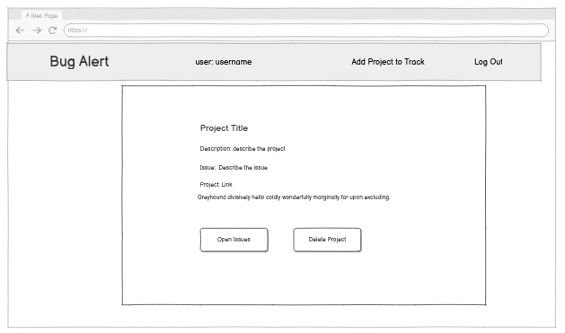

Project issues page

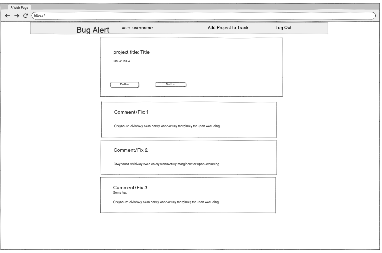

The final design deviated substantially from the early wireframes.

**Typography**

For the font I used "Play Fair" from google fonts. A sharp easy to read font.

**Colours**
The colour choice in Bug alert was made in the hopes of not distracting the user from the information. The buttons are coloured to draw attention to them. The colours for the different priorities helps make them stick out and help the user to quickly decide which issues to tackle. For the alerts I used the standard bootstrap colours with minimal customisation.

**Icons**
I purposely chose not to use any icons in this project. Icons that were initialy used were
removed after the realisation that they just cluttered up the user interface, distracted and confused test users. Icons alone are not enough to convey to users what, for example a button or link does, they always need a label. Therefore having a label and an icon cluttered the U.I making for a negative user experience.

## Agile Project

https://github.com/users/Drekkg/projects/9

I used the M.o.S.C.o.W principal to help me prioritise what should be included in the application
in the available time.

#### M - must have:

     - The ability to log user reported issues and bugs.
     - The ability to create an account
     - The ability to tie issues to specific projects.
     - The ability to comment upon issues

#### S - should have:

      - The ability to mark the priority of an issue.

#### C - could have:

      - The ability to mark an issue as resolved

#### W - will not have:

      - The ability to search through issues and projects

## Testing

### Manual Testing

https://github.com/user-attachments/assets/e73f6091-0577-4353-8e22-89833c7c2704
video of the app being tested.

1.  A new user clicks on the sign up page
2.  They enter a username.
3.  They enter a password
4.  They confirm their password.
5.  After clicking submit they are taken to the sign in page.
6.  They enter their username and password and signin.
7.  After signing in they are taken to the main projects page.
8.  They click on one of the project and open the issues panel.
9.  They then click on the add issue button and are taken to the add issue form.
10. After filling out all the relevant information and hitting add issue they are taken to the issue.
11. After clicking on view issue they are taken to the comments/response page.
12. Here the user enters any actions they have taken to fix the issue and or any comments.
13. The user the clicks on the back to issues button.
14. They then logout.
15. A new user logs.
16. As they are the owner of the issue and they are aware that the issue has been fixed they mark the issue as resolved.

https://github.com/user-attachments/assets/8f188305-6393-45ee-b3f6-18e113691067

Test 2: Add project, edit project and delete project

1. A signed in user adds a new project.
2. They click on edit project.
3. They add some changes to the project and are taken back to the issues page.
4. They click on delete and are greeted with a delete modal.
5. After clicking confirm, the project is deleted.
6. The user is returned to the Project list page.

All is data written and retrieved from the Bug Alert Django Rest Framework API.
All data persists and no errors have been observed.

Click here to go to the Back End repository:

Bug Alert DRF 22
https://github.com/Drekkg/bug-alert-drf22.git

## Responsive Testing

Bug Alert was tested on a variety of hardware devices.
It looked good and remained functional on the following devices:

- Samsung s20 Plus
- Samsung s23 Ultra
- Samsung s6 Tablet
- 14 inch linux Laptop
- 27 inch Windows Desktop

## Accessibility

The app scored over 90 in the lighthouse Accessibility test.

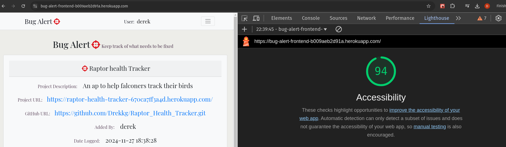

## Validation

The jsx linter ES lint(built in React) revealed no problems.

## Bugs and Issues

I encountered multiple and continuous dependency problems while developing using the Code Institute React template, 2 or 3 started projects had to be abandoned and restarted.
Even late in the development breaking dependencies caused me to lose a lot of time and sleep.

### Bugs

I started using Bug Alert myself while I was still building the app.
A list of fixed bugs can be found in the Project "Bug Alert" of the deployed app.

### known Issues and console errors

- unavoidable 401 errors in the console.
- The sign up form is pre-populated.

- A warning pertaining to the Babel package is apparent in the dev server.

  One of your dependencies, babel-preset-react-app, is importing the
  "@babel/plugin-proposal-private-property-in-object" package without
  declaring it in its dependencies. This is currently working because
  "@babel/plugin-proposal-private-property-in-object" is already in your
  node_modules folder for unrelated reasons, but it may break at any time.

babel-preset-react-app is part of the create-react-app project, which
is not maintianed anymore. It is thus unlikely that this bug will
ever be fixed. Add "@babel/plugin-proposal-private-property-in-object" to
your devDependencies to work around this error. This will make this message
go away.

After trying to resolve this warning I completely broke my application. Turns out to be an
issue with Create React App.

**commented out console logs**
As advised in the Moments walkthrough, console logs in the catch blocks are commented out for easy debugging in the future.

## Technologies used

- React nvm 20
- React Bootstrap v4.6
- Google Fonts
- Balsamiq
- GitHub
- Django Rest Framwork on the backend
- GitHub Copilot - included in our student
  GitHub account, I mainly used it to create commit messages.

  ## Deployment

  To prepare the app for deployment there are a couple of things that need to be addressed:

  - A procfile at root level containing the following:
    - web: serve -s build
  - In the package.json file file in the scripts section add:

    - "heroku-prebuild": "npm install -g serve",

  - Log into Heroku or create an account if you don't have one.
  - Go to the deploy section.
  - Link your GitHub repo to Heroku.
  - Cross your fingers and hit deploy.
  - Once deployed you can view your app by clicking on the view button.

## Credits

- https://stackoverflow.com/ - code solutions
- https://github.com/Code-Institute-Org/gitpod-full-template - Code Institute Template

- The Moments walkthrough served as a basis for my project.
- The codebase was adapted for my purposes.
- Juliia Konovalova my mentor.
- My partner Christine Steinbach.
- Kudos to Oisin - Code Institute Tutor - who helped me fix my project after I foolishly updated some dependencies, breaking my project 2 days before submission.
